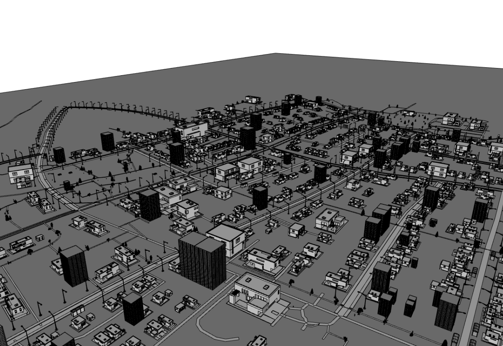

# Osm2Obj
Osm2Obj is a python script that creates a single object file based on the input of an open street map file. Streets, sidewalks, building, trees and other props are modeled and placed according to the map data and user configuration.



## Installation
Clone the DigitIdentifier repository and change to project directory:
```bash
git clone git@github.com:Topxic/osm2obj.git
cd osm2obj
```
Install the required dependencies:
```bash
pip install -r requirements.txt
```
